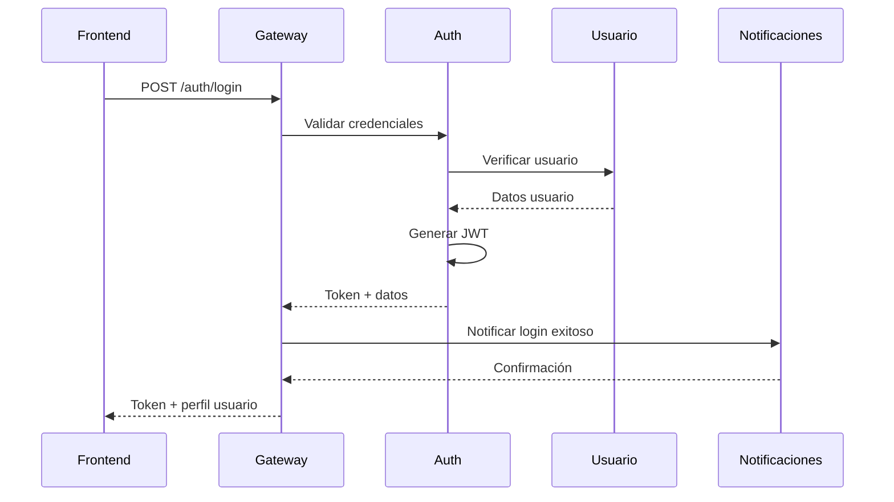
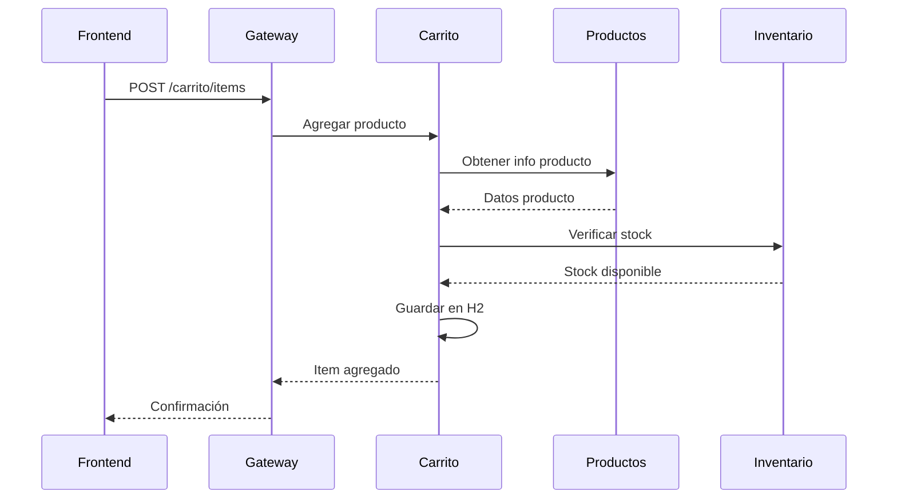
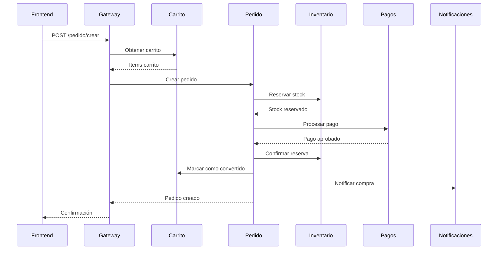
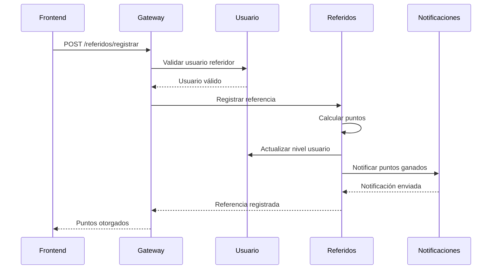
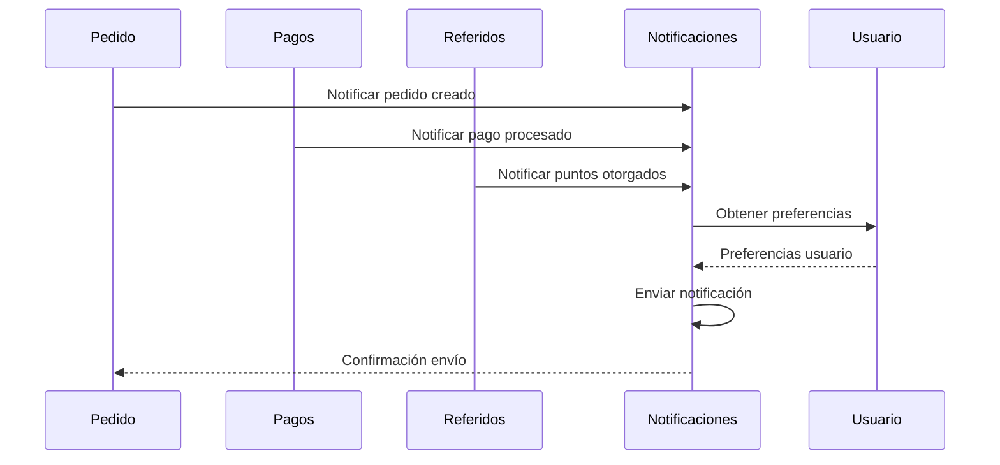

# Level-Up Gamer - Arquitectura de Microservicios

## 📋 Descripción del Proyecto

**Level-Up Gamer** es una plataforma de e-commerce especializada en productos gaming que integra un sistema de gamificación con referidos, eventos gaming, contenido educativo y un sistema completo de compras online.

## 🏗️ Arquitectura de Microservicios

### Diagrama de Comunicación
```
┌─────────────────┐    ┌─────────────────┐    ┌─────────────────┐
│   Frontend      │    │   API Gateway   │    │  Microservicios │
│   (React/Vue)   │◄──►│   (msvc-gateway)│◄──►│   (14 servicios)│
└─────────────────┘    └─────────────────┘    └─────────────────┘
```

### 🎯 Microservicios Implementados

| Microservicio | Puerto | Descripción | Estado |
|---------------|--------|-------------|---------|
| `msvc-gateway` | 8094 | API Gateway central | ✅ Completo |
| `msvc-auth` | 8001 | Autenticación y autorización JWT | ✅ Completo |
| `msvc-usuario` | 8095 | Gestión de usuarios y perfiles | ✅ Completo |
| `msvc-productos` | 8003 | Catálogo de productos gaming | ✅ Completo |
| `msvc-inventario` | 8004 | Control de stock e inventario | ✅ Completo |
| `msvc-pedido` | 8085 | Gestión de pedidos y órdenes | ✅ Completo |
| `msvc-notificaciones` | 8006 | Sistema de notificaciones multicanal | ✅ Completo |
| `msvc-carrito` | 8008 | Carrito de compras | ✅ Completo |
| `msvc-pagos` | 8011 | Procesamiento de pagos | ✅ Completo |
| `msvc-referidos` | 8005 | Sistema de referidos y gamificación | ✅ Completo |
| `msvc-resenia` | 8010 | Reseñas y calificaciones | ✅ Completo |
| `msvc-promociones` | 8091 | Promociones y descuentos | ✅ Completo |
| `msvc-eventos` | 8092 | Gestión de eventos gaming | ✅ Completo |
| `msvc-contenido` | 8093 | Contenido educativo y blogs | ✅ Completo |

## 🔄 Flujos de Comunicación por Casos de Uso

### 1. 🔐 Flujo de Autenticación



**Descripción:**
1. Usuario ingresa credenciales en el frontend
2. Gateway envía petición a `msvc-auth`
3. `msvc-auth` valida con `msvc-usuario`
4. Se genera JWT y se notifica el login
5. Frontend recibe token para autenticación

### 2. 🛒 Flujo de Carrito de Compras



**Descripción:**
1. Usuario presiona "Agregar al Carrito" en el frontend
2. Gateway envía petición a `msvc-carrito`
3. `msvc-carrito` consulta `msvc-productos` para obtener datos del producto
4. `msvc-carrito` verifica stock con `msvc-inventario`
5. Si hay stock, se guarda el item en la base de datos H2 del carrito
6. Frontend recibe confirmación y actualiza la UI

### 3. 💳 Flujo de Procesamiento de Pedido



**Descripción:**
1. Usuario presiona "Finalizar Compra" en el frontend
2. Gateway obtiene carrito activo del usuario
3. `msvc-pedido` crea el pedido y reserva stock
4. `msvc-pagos` procesa el pago
5. Si el pago es exitoso, se confirma la reserva y se notifica
6. El carrito se marca como convertido

### 4. 🎮 Flujo de Sistema de Referidos



**Descripción:**
1. Usuario ingresa código de referido en el frontend
2. `msvc-referidos` valida el código con `msvc-usuario`
3. Se calculan y otorgan puntos LevelUp
4. Se actualiza el nivel del usuario
5. Se envían notificaciones de puntos ganados

### 5. 📧 Flujo de Notificaciones



**Descripción:**
1. Los microservicios envían eventos a `msvc-notificaciones`
2. `msvc-notificaciones` obtiene preferencias del usuario
3. Se envía la notificación por el canal preferido (email, WhatsApp, SMS, push)
4. Se registra el estado de entrega

## 🗄️ Bases de Datos por Microservicio

| Microservicio | Base de Datos | Tablas Principales |
|---------------|---------------|-------------------|
| `msvc-auth` | PostgreSQL | auth_tokens, sesiones |
| `msvc-usuario` | PostgreSQL | usuarios, perfiles, preferencias |
| `msvc-productos` | PostgreSQL | productos, categorias, especificaciones |
| `msvc-inventario` | PostgreSQL | stock, movimientos, alertas |
| `msvc-carrito` | PostgreSQL | carritos, items_carrito |
| `msvc-pedido` | PostgreSQL | pedidos, items_pedido, estados |
| `msvc-pagos` | PostgreSQL | pagos, transacciones |
| `msvc-referidos` | PostgreSQL | referencias, puntos, niveles |
| `msvc-resenia` | PostgreSQL | resenias, calificaciones |
| `msvc-promociones` | PostgreSQL | promociones, cupones |
| `msvc-eventos` | PostgreSQL | eventos, participantes |
| `msvc-contenido` | PostgreSQL | articulos, comentarios |
| `msvc-notificaciones` | PostgreSQL | notificaciones, plantillas |

## 🔧 Tecnologías Utilizadas

### Backend
- **Spring Boot 3.x** - Framework principal
- **Spring Cloud** - Microservicios y configuración
- **Spring Data JPA** - Persistencia de datos
- **Spring Security** - Seguridad y autenticación
- **OpenFeign** - Comunicación entre microservicios
- **H2 Database** - Base de datos en memoria para desarrollo
- **Swagger/OpenAPI** - Documentación de APIs
- **Lombok** - Reducción de código boilerplate

### Comunicación
- **REST APIs** - Comunicación HTTP
- **JWT** - Autenticación stateless
- **HATEOAS** - Navegación de recursos
- **Circuit Breaker** - Tolerancia a fallos

## 🚀 Casos de Uso Detallados

### Caso 1: Usuario Nuevo Registra Cuenta

```
Frontend → Gateway → Auth → Usuario → Notificaciones → Usuario
```

1. **Frontend**: Usuario llena formulario de registro
2. **Gateway**: Recibe POST /usuarios/registrar
3. **Auth**: Valida datos y genera token
4. **Usuario**: Guarda perfil en H2
5. **Notificaciones**: Envía email de bienvenida
6. **Usuario**: Actualiza estado de verificación

### Caso 2: Usuario Agrega Producto al Carrito

```
Frontend → Gateway → Carrito → Productos → Inventario → Carrito → Gateway → Frontend
```

1. **Frontend**: Usuario hace clic en "Agregar al Carrito"
2. **Gateway**: POST /carrito/items con JWT
3. **Carrito**: Valida usuario y obtiene carrito activo
4. **Productos**: Obtiene datos del producto (precio, nombre)
5. **Inventario**: Verifica disponibilidad de stock
6. **Carrito**: Guarda item en H2 y recalcula totales
7. **Frontend**: Recibe confirmación y actualiza UI

### Caso 3: Usuario Finaliza Compra

```
Frontend → Gateway → Carrito → Pedido → Inventario → Pagos → Notificaciones → Pedido → Carrito
```

1. **Frontend**: Usuario presiona "Finalizar Compra"
2. **Gateway**: POST /pedido/crear
3. **Carrito**: Obtiene items del carrito activo
4. **Pedido**: Crea pedido y reserva stock
5. **Inventario**: Marca productos como reservados
6. **Pagos**: Procesa pago con proveedor externo
7. **Notificaciones**: Envía confirmación de compra
8. **Pedido**: Marca como pagado
9. **Carrito**: Marca como convertido

### Caso 4: Usuario Participa en Evento Gaming

```
Frontend → Gateway → Eventos → Usuario → Referidos → Notificaciones
```

1. **Frontend**: Usuario se inscribe a evento
2. **Gateway**: POST /eventos/{id}/inscribir
3. **Eventos**: Valida disponibilidad y edad
4. **Usuario**: Verifica datos del usuario
5. **Referidos**: Otorga puntos por participación
6. **Notificaciones**: Envía recordatorio del evento

### Caso 5: Usuario Lee Contenido Premium

```
Frontend → Gateway → Contenido → Usuario → Contenido → Gateway → Frontend
```

1. **Frontend**: Usuario accede a artículo premium
2. **Gateway**: GET /contenido/articulos/{id}
3. **Contenido**: Verifica si es premium
4. **Usuario**: Valida suscripción premium
5. **Contenido**: Retorna contenido completo
6. **Frontend**: Muestra artículo completo

## 📊 Métricas y Monitoreo

### Logs por Microservicio
- **Auth**: Intentos de login, tokens generados
- **Usuario**: Registros, actualizaciones de perfil
- **Carrito**: Items agregados, carritos abandonados
- **Pedido**: Pedidos creados, conversiones
- **Pagos**: Transacciones exitosas/fallidas
- **Notificaciones**: Notificaciones enviadas, entregadas

### KPIs del Sistema
- **Conversión**: Carrito → Pedido
- **Abandono**: Carritos no convertidos
- **Engagement**: Tiempo en contenido
- **Referidos**: Nuevos usuarios por referencias
- **Eventos**: Participación en eventos gaming

## 🔒 Seguridad

### Autenticación
- **JWT Tokens** con expiración configurable
- **Refresh Tokens** para renovación automática
- **Rate Limiting** por usuario/IP

### Autorización
- **Roles**: ADMIN, USER, PREMIUM
- **Permisos**: Lectura, escritura por recurso
- **Validación**: En cada endpoint crítico

## 🚀 Instalación y Ejecución

### Prerrequisitos
- Java 21+
- Maven 3.9+
- IDE (IntelliJ IDEA, Eclipse, VS Code)

### Ejecución Local
```bash
# Clonar repositorio
git clone <repository-url>
cd Level-Up-Gamer

# Ejecutar cada microservicio
cd msvc-gateway && mvn spring-boot:run
cd msvc-auth && mvn spring-boot:run
cd msvc-usuario && mvn spring-boot:run
# ... (repetir para cada microservicio)
```

### Docker Compose (Entorno local con PostgreSQL)
```bash
# 1. Construir los artefactos (desde la raíz de Backend_Java_Spring/Fullstack_Ecommerce)
mvn -pl msvc-auth,msvc-usuario,msvc-productos,msvc-inventario,msvc-carrito,msvc-pedido,msvc-pagos,msvc-resenia,msvc-referidos,msvc-promociones,msvc-notificaciones,msvc-eventos,msvc-contenido,msvc-gateway -am clean package -DskipTests

# 2. Exportar variables opcionales (JWT_SECRET, S3_BASE_URL, etc.) o editar docker.env del frontend

# 3. Levantar toda la plataforma
docker compose up --build

# 4. (opcional) Detener y limpiar
docker compose down -v
```

El stack utiliza `postgres:15-alpine` y un script en `docker/postgres/create-multiple-dbs.sh` para crear las bases de datos individuales de cada microservicio. Las propiedades `application-docker.properties` activan Hikari/DDL `update` y CORS locales. Configura el frontend copiando `docker.env` a `.env.local` y ejecutando `npm run dev` o `npm run preview`.

## 📝 Documentación de APIs

### Swagger UI
- **Gateway**: http://localhost:8094/swagger-ui.html
- **Auth**: http://localhost:8001/swagger-ui.html
- **Usuario**: http://localhost:8095/swagger-ui.html
- **Productos**: http://localhost:8003/swagger-ui.html
- **Carrito**: http://localhost:8008/swagger-ui.html
- **Pedido**: http://localhost:8085/swagger-ui.html
- **Pagos**: http://localhost:8011/swagger-ui.html

## 🧪 Testing

### Tests Unitarios
```bash
mvn test
```

### Tests de Integración
```bash
mvn integration-test
```

### Tests de Carga
```bash
# Usando JMeter o similar
jmeter -n -t load-test.jmx
```

## 📈 Escalabilidad

### Estrategias Implementadas
- **Circuit Breaker**: Tolerancia a fallos
- **Load Balancing**: Distribución de carga
- **Caching**: Redis para datos frecuentes
- **Async Processing**: Colas para operaciones pesadas

### Monitoreo
- **Health Checks**: Estado de cada microservicio
- **Metrics**: Prometheus + Grafana
- **Logs**: ELK Stack (Elasticsearch, Logstash, Kibana)

## 🤝 Contribución

### Flujo de Trabajo
1. Fork del repositorio
2. Crear feature branch
3. Implementar cambios
4. Ejecutar tests
5. Crear Pull Request

### Estándares de Código
- **Java**: Google Java Style Guide
- **Commits**: Conventional Commits
- **Documentación**: JavaDoc obligatorio

## 📞 Soporte

### Contacto
- **Email**: dev@levelupgamer.com
- **Slack**: #level-up-gamer-dev
- **Issues**: GitHub Issues

### Documentación Adicional
- [Guía de Desarrollo](docs/development-guide.md)
- [Guía de Deployment](docs/deployment-guide.md)
- [Troubleshooting](docs/troubleshooting.md)

---

**Level-Up Gamer** - Transformando la experiencia gaming 🎮
